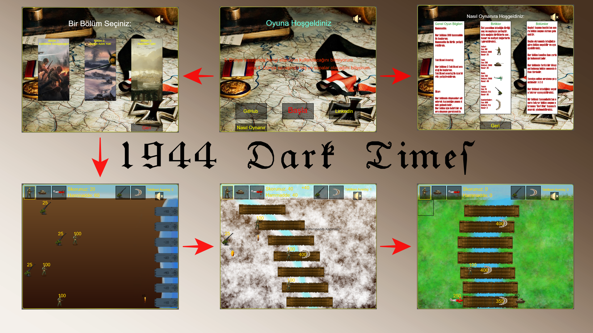

# 1944 Dark Times 💣

> Bu oyun Web Tabanlı Programlama dersi için geliştirilmiş Html, Css, Javascript teknolojileri ile hazırlanmış bir oyunudur. 🎮

## Oyun Senaryosu 📖
___

Alternatif bir evrende 1944 yılını ele alan bu oyun, o dönemde yaşanmış 3 alternatif cepheyi ele almakta olup, her cephenin sonucunda hikayenin bir kısmında ilerleme kaydeden oyuncu 3 bölümüde bitirdiğinde hikayenin bütünlüğüne vakıf olacak.

## Kullanılan Teknolojiler 💻
___

- Html
- Css
- JavaScript

## Nasıl Oynanır ve Oyundan Genel Görüntü 📽️
___

Oyun savunma bazlı 2 boyutlu bir yapıda olup, seçtiğiniz bölümde sahip olduğunuz kaynaklar ile yeni birlikleri cepheye yerleştirebilir ve savunmanızı böylece gerçekleştirebilirsiniz. Ayrıca yerleştirdiğiniz birlikler, düşman birliklerini alt ettikçe, alt edilen düşmana göre kaynak elde edersiniz ve böylece savunmanın devamlılığını sağlamış olursunuz.
> Detaylı oynanış bilgisini elde etmek için oyunun giriş menusunde bulunan nasıl oynanır bölümünü ziyaret edebilirsiniz.

## Tasarımlar 🔍
___
Tasarımlara [buradan](https://www.figma.com/file/hfZoM0mIkSbfpFQR8enbaI/1944-Dark-Times-Tasar%C4%B1mlar%C4%B1?node-id=0%3A1) ulaşabilirsiniz.

## Nasıl Çalıştırabilirim ⚙️
___
***Oyunu hostlanmış demo adresinden deneyimlemek yerine kendi cihazınızda oyunu deneyimlemek isterseniz:***
``    git clone https://github.com/BijanE/Dark-Times-1944.git ``
``    cd Dark-Times-1944.git ``
``    open index.html      ``

## İletişim 📧
___
[Bijan Etesam](https://www.linkedin.com/in/bijan-etesam-37a8b0194/)